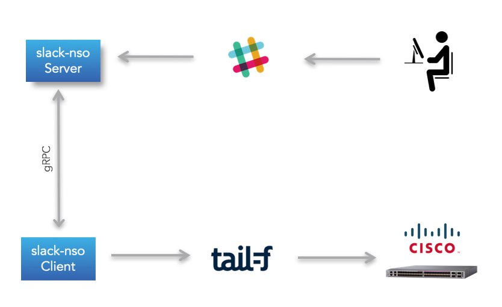

# Slack-NSO

Small PoC to control NSO via Slack.



## Example

**Slack**


**Router**

```bash
RP/0/RP0/CPU0:mrstn-5501-1.cisco.com# sh run router static 
  
Wed Jan  3 19:47:48.431 UTC
router static
 address-family ipv4 unicast
  192.16.0.0/16 10.0.0.1
 !
 address-family ipv6 unicast
  ::/0 2001:420:2cff:1204::1
  2001:db8::/32 2001:cafe:f00::1
 !
!
```

## Compiling protocol buffers

```bash
cd proto
protoc --go_out=plugins=grpc:. comm.proto
```

## Generating SSL Certificates

- Local testing

```bash
openssl req -x509 -newkey rsa:4096 -keyout key.pem -out cert.pem -days 365 -nodes -subj '/CN=localhost'
```

- Online testing

CN needs to be replaced with your gRPC Server.

```bash
openssl req -x509 -newkey rsa:4096 -keyout key.pem -out cert.pem -days 365 -nodes -subj '/CN=grpc.nleiva.com'
```

## Generating binaries for Client and Server

- gRPC client: `go build -o cli client/main.go`
- gRPC server: `go build -o serv server/main.go`

## Enviroment variables required

- SLACK_TOKEN
- NSO_SERVER
- NSO_DEVICE
- NSO_USER
- NSO_PASSWORD

## Running in Docker Containers

Setup your enviroment variables in `env.client` and `env.server`.

- Client

```bash
docker build -t client -f ./server/Dockerfile .
docker run -t --rm --name my-client --env-file ./env.client client
```

- Server

```bash
docker build -t server -f ./server/Dockerfile .
docker run -t --rm --name my-server --env-file ./env.server server
```

Just in case...

[docker build](https://docs.docker.com/edge/engine/reference/commandline/build/#usage)

```
--tag , -t    Name and optionally a tag in the ‘name:tag’ format
--file , -f   Name of the Dockerfile (Default is ‘PATH/Dockerfile’)
```

[docker run](https://docs.docker.com/edge/engine/reference/commandline/container_run/#usage)

```
--tty , -t    Allocate a pseudo-TTY
--rm          Automatically remove the container when it exits
--name        Assign a name to the container
--env-file    Read in a file of environment variables
```

### Example

The Server is a 28.9MB Container.

```bash
$ docker ps
CONTAINER ID        IMAGE               COMMAND             CREATED             STATUS              PORTS               NAMES
a16c6080fc73        server              "/serv"             4 minutes ago       Up 4 minutes        50051/tcp           my-server
```

```bash
$ docker images
REPOSITORY               TAG                 IMAGE ID            CREATED             SIZE
server                   latest              8149f0b8ed06        17 minutes ago      28.9MB
...
```
